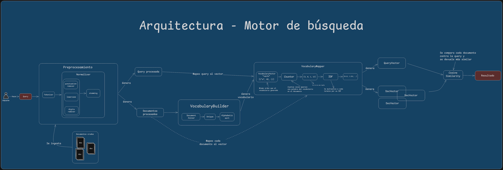
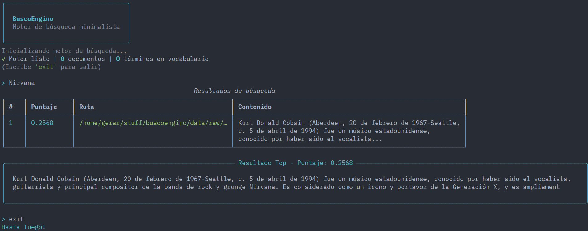

# Buscoengino - Search Engine from Scratch

Un motor de búsqueda minimalista implementado desde cero para comprender los fundamentos de Information Retrieval (IR). Este proyecto cubre parsing de texto, tokenización, índices invertidos, scoring (TF/TF-IDF) y ranking básico.

## Propósito

Buscoengino es un proyecto diseñado para:

- Entender el pipeline completo de un motor de búsqueda
- Implementar conceptos clave de IR sin abstracciones innecesarias
- Servir como base para experimentos con ranking y relevancia
- Ser escalable sin sobreingeniería inicial

## Arquitectura del Motor



## Interfaz CLI

Buscoengino incluye una interfaz de línea de comandos interactiva que permite realizar búsquedas fácilmente y ver los resultados relevantes.



Para iniciar la interfaz interactiva:
```bash
uv run buscoengino
```

## Instalación

> Notar que se usa uv como gestor de dependencias, sin embargo se deja un archivo requirements.txt para quien quiera instalar dependencias usando venv.

```bash
# Clonar el repositorio
git clone https://github.com/Gerardo1909/buscoengino.git
cd buscoengino

# Instalar dependencias
uv sync

# Ejecutar tests
uv run pytest -v
```

## Estructura del Proyecto

```
buscoengino/
├── pyproject.toml              # Configuración del proyecto y CLI
├── uv.lock                     # Lock file para reproducibilidad
├── README.md
│
├── data/
│   ├── raw/documents/          # Documentos que alimentan al motor
│   └── stop_words.txt          # Archivo con stop words para limpiar vocabulario
│
├── docs/                       # Imágenes y diagramas
│
├── src/
│   ├── cli/
│   │   └── main.py             # Interfaz interactiva de consola (CLI)
│   │
│   └── search_engine/          # Código principal del motor de búsqueda
│       ├── config/
│       │   └── settings.py     # Paths y configuraciones globales
│       │
│       ├── ingestion/
│       │   └── loader.py       # Lectura de documentos desde disco
│       │
│       ├── models/
│       │   └── documents.py    # Modelos de datos centrales (Document, SearchResult, etc.)
│       │
│       ├── preprocessing/
│       │   ├── tokenizer.py    # Conversión de texto a tokens
│       │   ├── normalizer.py   # Normalización (minúsculas, limpieza, stemming)
│       │   └── stopwords.py    # Filtrado de palabras vacías
│       │
│       ├── indexing/
│       │   └── vocabulary.py   # Construcción del vocabulario del corpus
│       │
│       ├── ranking/
│       │   ├── tfidf.py        # Cálculo de TF-IDF y vectorización
│       │   └── scorer.py       # Cálculo de similitud coseno
│       │
│       └── search/
│           ├── engine.py       # Pipeline principal explícito (BuscoEngino)
│           └── feedback.py     # Almacenamiento y cálculo de retroalimentación histórica
│
└── tests/
    └── test_engine.py          # Pruebas unitarias y de integración principales
```

## Pipeline de IR

El motor funciona mediante un flujo explícito en las siguientes etapas:

### 1. Ingesta (Ingestion)
- Carga de documentos de texto plano desde el disco y almacenamiento de metadatos (ruta, contenido).

### 2. Preprocesamiento (Preprocessing)
- **Tokenización:** División del texto crudo en palabras individuales.
- **Normalización:** Conversión a minúsculas, eliminación de signos de puntuación y dígitos, además de aplicar stemming en español.
- **Stopwords:** Eliminación de palabras vacías utilizando un corpus de stopwords.

### 3. Representación y Vocabulario (Indexing)
- Construcción de un vocabulario único y materialización del estado completo del corpus (CorpusState).

### 4. Ranking y Vectorización (Ranking)
- **TF (Term Frequency):** Cálculo de frecuencias de los términos normalizados.
- **IDF (Inverse Document Frequency):** Asignación de frecuencias inversas de los documentos del corpus.
- **Vectores TF-IDF:** Transformación de cada documento en representaciones vectoriales matemáticas.
- **Scoring:** Cálculo de la similitud coseno.

### 5. Búsqueda (Search) y Feedback
- Preprocesamiento de la consulta (query) del usuario aplicando los mismos pasos de normalización.
- Vectorización de la consulta.
- Comparación de la consulta frente a los vectores del corpus mediante similitud coseno (Puntaje TF-IDF).
- Consulta al almacén de feedback buscando la consulta histórica más cercana (Nearest Neighbor) a la actual.
- Interpolación de puntajes (TF-IDF + Histórico) para elevar los documentos que los usuarios consideraron relevantes previamente.
- Retorno de resultados con puntaje (score) mayor a cero, ordenados por relevancia.

## Testing

El proyecto contiene pruebas unitarias exhaustivas y de integración para asegurar que cada módulo funciona correctamente. Se utilizó `pytest`.

Ejecutar tests con reporte de cobertura:
```bash
uv run pytest -v
uv run pytest --cov=src/search_engine tests/
```

---

**Stack:** Python 3.13 · NLTK · Rich · Pytest

**Autor:** Gerardo Toboso · [gerardotoboso1909@gmail.com](mailto:gerardotoboso1909@gmail.com)

**Licencia:** MIT
